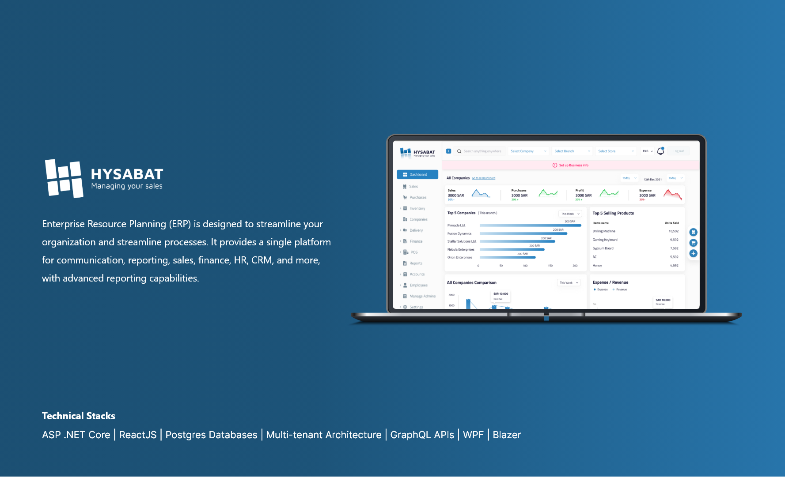

# Enterprise-Resource-Planning

INTRODUCTION

Our ERP project integrates Sales, Purchases, Finance, Inventory Management, POS, and HRM modules to streamline operations and enhance financial control. It automates account updates, standardizes charts of accounts, and centralizes data for better decision-making, significantly boosting overall business performance.

SYSTEM FEATURES

1. Sales Management: Streamlines order processing and customer interactions.
2. Purchases: Optimizes procurement processes and supplier management.
3. Finances: Ensures accurate financial control and transparent reporting.
4. Automatic Accounts Updation: Automates real-time updates to financial records.
5. Charts of Accounts: Provides a standardized framework for organizing financial data.
6. Inventory Management: Optimizes stock levels and order fulfillment.
7. Organization Management: Centralizes data related to organizational structure.
8. POS (Point of Sale): Facilitates efficient retail transactions.
9. HRM (Human Resource Management): Streamlines human resource 

TECNICALITIES/TOOLS USED

1. ASP .NET Core
2. ReactJs
3. Postgres Databases
4. Multi-tenant(SAAS) Architecture
5. GraphQL APIs
6. WPF
7. Blazer

SYSTEM SCREENSHOTS

WEB APPLICATION
 

POS APPLICATION
 

